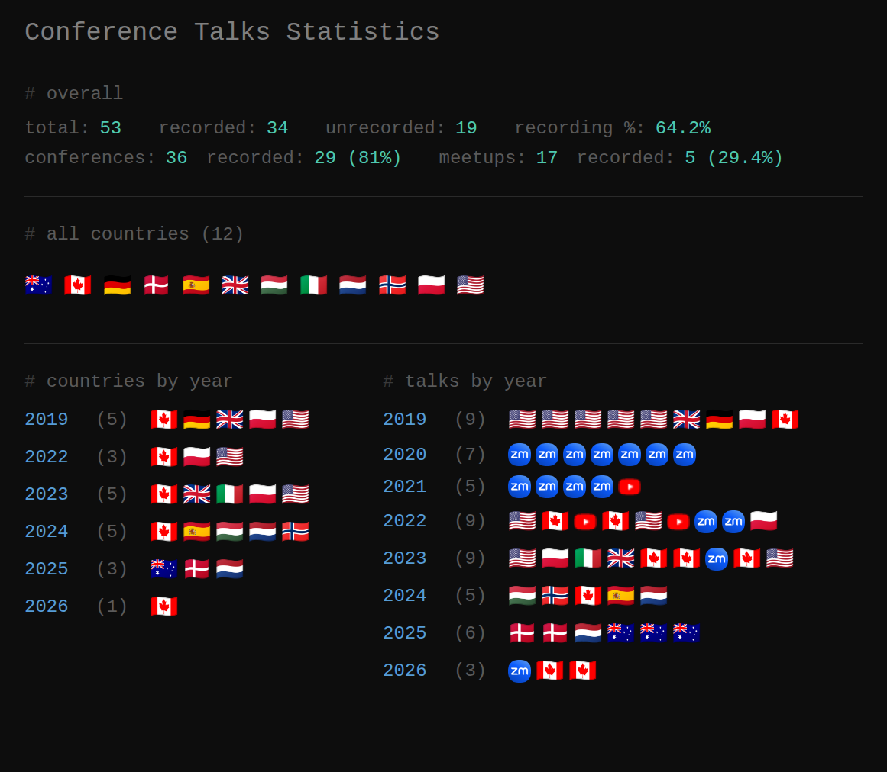

### Legend

💚 **= Conference**  
💙 **= Meetup**  
⭐ **= Recommended version**  
🍀 **= Submitted but not accepted**

## Conference Talks

YouTube Playlist: [Link](https://www.youtube.com/playlist?list=PLVFrD1dmDdvdwBa7nPNCjA00m31MkNIlb)

| Conference/Meetup   |  Year   |    Location    |                                               Talk                                                |
| :------------------ | :-----: | :------------: | :-----------------------------------------------------------------------------------------------: |
| 💙 Bay Area C++      | 2019-01 | Santa Clara, 🇺🇸 |                                        Algorithm Intuition                                        |
| 💚 C++Now            | 2019-05 |    Aspen, 🇺🇸    |                       ⭐ [Algorithm Intuition](https://youtu.be/48gV1SNm3WA)                       |
| 💙 Bay Area C++      | 2019-06 |  San Fran, 🇺🇸   |                                        Algorithm Intuition                                        |
| 💚  CppCon           | 2019-09 |   Aurora, 🇺🇸    |                        [Algorithm Intuition](https://youtu.be/pUEnO6SvAMo)                        |
| 💙 Bay Area C++      | 2019-10 | Santa Clara, 🇺🇸 |                                    Better Algorithm Intuition                                     |
| 💚 ACCU Belfast      | 2019-11 |   Belfast, 🇬🇧   |                                    Better Algorithm Intuition                                     |
| 💚 Meeting C++       | 2019-11 |   Berlin, 🇩🇪    |                   ⭐ [Better Algorithm Intuition](https://youtu.be/TSZzvo4htTQ)                    |
| 💚 code::dive        | 2019-11 |   Wroclaw, 🇵🇱   |                    [Better Algorithm Intuition](https://youtu.be/0z-cv3gartw)                     |
| 💙 C++TO             | 2019-12 |   Toronto, 🇨🇦   |                    [Better Algorithm Intuition](https://youtu.be/L0kwN3A-HkM)                     |
| 💚 PyCon             | 2020-04 |     Online     |                  ⭐ [Beautiful Python Refactoring](https://youtu.be/W-lZttZhsUY)                   |
| 💙 MUC++             | 2020-06 |     Online     |                  [My Least Favorite Anti-Pattern](https://youtu.be/VV9vwFsaQ6U)                   |
| 💚 Italian C++       | 2020-06 |     Online     |           [My Least Favorite Anti-Pattern](https://www.youtube.com/watch?v=CjHgL5EQdcY)           |
| 💚 CppCon            | 2020-09 |     Online     |                              ⭐ [SICP](https://youtu.be/7oV7hiAsVTI)                               |
| 💙 C++TO             | 2020-11 |     Online     |                         C++ Concepts - Rust Traits - Haskell Typeclasses                          |
| 💚 Meeting C++       | 2020-11 |     Online     | ⭐ [C++ Concepts - Rust Traits - Haskell Typeclasses](https://www.youtube.com/watch?v=Qh7QdG5RK9E) |
| 💚 C++ Russia        | 2020-11 |     Online     |       ⭐ [ITM: My Least Favorite Anti-Pattern](https://www.youtube.com/watch?v=vOgyn1jcKGY)        |
| 💚 ACCU              | 2021-03 |     Online     |  [C++ Concepts - Rust Traits - Haskell Typeclasses](https://www.youtube.com/watch?v=iPVoCTgvi8M)  |
| 💙 Britsh APL        | 2021-03 |     Online     |                                  Algorithms as a Tool of Thought                                  |
| 💚 APL Seeds         | 2021-03 |     Online     |                 ⭐ [Algorithms as a Tool of Thought](https://youtu.be/GZuZgCDql6g)                 |
| 💚 GTC               | 2021-04 |     Online     |      ⭐ [Thrust and the C++ Standard Algorithms](https://www.youtube.com/watch?v=zlJg9mCNfkQ)      |
| 💚 Strange Loop*     | 2021-10 |    YouTube     |         ⭐ [Functional vs Array Programming](https://www.youtube.com/watch?v=UogkQ67d0nY)          |
| 💚 ARRAY             | 2022-06 |  San Diego, 🇺🇸  |                     Combinatory Logic and Combinators   in Array Languages                     |
| 💚 CppNorth          | 2022-07 |   Toronto, 🇨🇦   |                [The Twin Algorithms](https://www.youtube.com/watch?v=w37XnvIf6qE)                 |
| 💚 YouTube           | 2022-07 |     Online     |               ⭐ [The Twin Algorithms](https://www.youtube.com/watch?v=NiferfBvN3s)                |
| 💙 Dyalog APL        | 2022-09 |   Toronto, 🇨🇦   |                                     A Look at Array Languages                                     |
| 💙 Dyalog APL        | 2022-09 |  New York, 🇺🇸   |                                     A Look at Array Languages                                     |
| 💙 YouTube           | 2022-09 |     Online     |                    ⭐ [A Look at Array Languages](https://youtu.be/8ynsN4nJxzU)                    |
| 💚 Paradigm Conf     | 2022-09 |     Online     |          ⭐ [Popular vs Less Well Known PLs](https://www.youtube.com/watch?v=8oKAHQsh1oM)          |
| 💙 HelwanU GDSC      | 2022-10 |     Online     |                                     A Look at Array Languages                                     |
| 💚 code::dive        | 2022-11 |   Wroclaw, 🇵🇱   |         ⭐ [Beautiful Python Refactoring II](https://www.youtube.com/watch?v=nXZQfdxWgh0)          |
| 💚 KX Con            | 2023-05 |   Montauk, 🇺🇸   |                  [Algorithms in q](https://www.youtube.com/watch?v=7ANmsW7crIQ)                   |
| 💚 LambdaDays        | 2023-06 |   Krakow, 🇵🇱    |               [Composition Intuition](https://www.youtube.com/watch?v=Mj8jxYS-hi4)                |
| 💚 Italian C++       | 2023-06 |    Rome, 🇮🇹     |              [New Algorithms in C++23](https://www.youtube.com/watch?v=5FU7Gtkb0IA)               |
| 💚 C++ on Sea        | 2023-06 | Folkestone, 🇬🇧  |              [New Algorithms in C++23](https://www.youtube.com/watch?v=uYFRnsMD9ks)               |
| 💚 CppNorth          | 2023-07 |   Toronto, 🇨🇦   |              ⭐ [Composition Intuition](https://www.youtube.com/watch?v=JELcdZLre3s)               |
| 💚 CppNorth          | 2023-07 |   Toronto, 🇨🇦   |             ⭐ [New Algorithms in C++23](https://www.youtube.com/watch?v=VZPKHqeUQqQ)              |
| 💙 iO EVM*           | 2023-07 |     Online     |                  [New Algorithms in C++23](https://youtu.be/d5-jboUZ7w8?t=3758)                   |
| 💙 Dyalog APL        | 2023-10 |   Toronto, 🇨🇦   |                                         Why Combinators?                                          |
| 💚 Minnowbrook¹      | 2023-10 | Indian Lake, 🇺🇸 |                                         Why Combinators?                                          |
| 💚 Craft Conf        | 2024-05 |  Budapest, 🇭🇺   |         [The Power of Function Composition](https://www.youtube.com/watch?v=umb5vTP_g7c)          |
| 💚 NDC Oslo          | 2024-06 |    Oslo, 🇳🇴     |         [The Power of Function Composition](https://www.youtube.com/watch?v=fuX4bQefvWQ)          |
| 💚 CppNorth          | 2024-07 |   Toronto, 🇨🇦   |             ⭐ [Composition Intuition II](https://www.youtube.com/watch?v=Tsa5JK4nnQE)             |
| 💚 Lambda World      | 2024-10 |    Cadiz, 🇪🇸    |        ⭐ [The Power of Function Composition](https://www.youtube.com/watch?v=W7fjzdEJnvY)         |
| 💚 C++ Under the Sea | 2024-10 |    Breda, 🇳🇱    |          [Arrays, Fusion and CPUs vs GPUs](https://www.youtube.com/watch?v=q5FmkSEDA2M)           |
| 💙 Roku Symposium    | 2025-09 |   Aarhus, 🇩🇰    |                                      Postmodern C++ for GPUs                                      |
| 💙 Copenhagen C++    | 2025-09 | Copenhagen, 🇩🇰  |                                      Postmodern C++ for GPUs                                      |
| 💚 C++ Under the Sea | 2025-10 |    Breda, 🇳🇱    |                                    Functional GPU Programming                                     |
| 💚 YOW! Melbourne    | 2025-12 |       🇦🇺        |                                         Enter the Matrix                                          |
| 💚 YOW! Brisbane     | 2025-12 |       🇦🇺        |                  [Enter the Matrix](https://www.youtube.com/watch?v=OJ6keePxWPg)                  |
| 💚 YOW! Sydney       | 2025-12 |       🇦🇺        |                                         Enter the Matrix                                          |
| 💙 C++ Africa        | 2026-04 |     Online     |                     [Parrot: Array GPU Programming](https://www.youtube.com/watch?v=Sm7pLXT_9Qs)                              |
| 💙 C++ Toronto       | 2026-04 |   Toronto, 🇨🇦   |                                   Parrot: Array GPU Programming                                   |
| 💚 NDC Toronto       | 2026-05 |   Toronto, 🇨🇦   |                                     Algorithms & Combinators                                      |

1 - Also known as: APL Implementer's Workshop  
\* - Engineering Virtual Meetup

## Lightning Talks

YouTube Playlist: [Link](https://www.youtube.com/playlist?list=PLVFrD1dmDdvfXxpnXpGfoHj3TMsMDL4oK)

| Conference/Meetup |  Year   |   Location   |                                       Talk                                       |
| :---------------- | :-----: | :----------: | :------------------------------------------------------------------------------: |
| 💚 C++Now          | 2019-05 |   Aspen, 🇺🇸   |           ⭐ [C++ Algorithms in Haskell](https://youtu.be/dTO3-1C1-t0)            |
| 💚 CppCon          | 2019-09 |  Aurora, 🇺🇸   |        ⭐ [C++23 Ranges: `slide` & `stride`](https://youtu.be/-_lqZJK2vjI)        |
| 💚 Meeting C++     | 2019-11 |  Berlin, 🇩🇪   |           ⭐ [Consistently Inconsistent](https://youtu.be/tsfaE-eDusg)            |
| 💙 C++TO           | 2019-11 |  Toronto, 🇨🇦  |            [Consistently Inconsistent](https://youtu.be/14zEh6QCevw)             |
| 💙 YouTube         | 2020-05 |    Online    |         ⭐ [The STL Algorithm Cheat Sheet](https://youtu.be/LMmFpOhcQhA)          |
| 💚 CppCon          | 2020-09 |    Online    |             ⭐ [SICP Cover Demystified](https://youtu.be/e0vnRZN5GB0)             |
| 💚 ACCU            | 2021-03 |    Online    |       ⭐ [Algorithm Selection](https://www.youtube.com/watch?v=nV4uXgyDCqc)       |
| 💙 YouTube         | 2022-12 |    Online    |              ⭐ [From C ➡️ C++ ➡️ Rust](https://youtu.be/wGCWlI4A5z4)               |
| 💚 LambdaDays      | 2023-06 |  Krakow, 🇵🇱   |      ⭐ [C++ vs Haskell vs BQN](https://www.youtube.com/watch?v=XJ3QWOSZ8Nk)      |
| 💚 C++ On Sea      | 2023-06 | Folkstone, 🇬🇧 | [C++ vs Haskell vs BQN](https://youtu.be/OSlo22JL8h0?si=81-VbBLWXQ7dJe1S&t=3187) |

`* ~ Unofficially`

## Workshops

| Conference/Meetup |  Year   | Location |                                                 Talk                                                  |
| :---------------- | :-----: | :------: | :---------------------------------------------------------------------------------------------------: |
| 💚 Lambda World    | 2024-10 | Cadiz, 🇪🇸 | [Tacit Programming in BQN, Kap and Uiua](https://github.com/codereport/2024-10-Lambda-World-Workshop) |

## Podcast Appearances

|       Podcast       |    Date    |  Episode #  |                                                                      Title                                                                       |
| :-----------------: | :--------: | :---------: | :----------------------------------------------------------------------------------------------------------------------------------------------: |
|       CppCast       | 2018-02-23 | Episode 139 |                                            [Competitive Coding](https://cppcast.com/conor-hoekstra/)                                             |
|    Take Up Code     | 2019-09-25 | Episode 261 | [CppCon: C++ Algorithms And Ranges.](https://www.takeupcode.com/podcast/261-cppcon-interview-with-conor-hoekstra-about-c-algorithms-and-ranges/) |
|  Talk Python To Me  | 2020-08-01 | Episode 275 |                    [Beautiful Pythonic Refactorings](https://talkpython.fm/episodes/show/275/beautiful-pythonic-refactorings)                    |
|      cpp.chat       | 2020-10-08 | Episode 75  |                                                   [I Really Like Sugar](https://cpp.chat/75/)                                                    |
|       CppCast       | 2020-11-19 | Episode 274 |                              [Concepts and Algorithm Intuition](https://cppcast.com/concepts-algorithm-intuition/)                               |
|     CoRecursive     | 2021-06-02 | Episode 60  |                    [From Competitive Programming to APL](https://corecursive.com/065-competitive-coding-with-conor-hoekstra/)                    |
|  Oxide and Friends  | 2023-10-16 | Episode 93  |                                           [Settling Beef](https://www.youtube.com/watch?v=jZs3hEBXcSw)                                           |
| Software Unscripted | 2023-11-26 | Episode 77  |                              [How Programming has Changed](https://open.spotify.com/episode/6srG2IXZaUY1dJIHYLr46b)                              |

## Publications

|    Type    |  Date   |                                                                                            Title                                                                                            |                          Where                           |
| :--------: | :-----: | :-----------------------------------------------------------------------------------------------------------------------------------------------------------------------------------------: | :------------------------------------------------------: |
| MSc Thesis | 2022-05 | [A Combinator, N-Dimensional Array Library In Smalltalk](https://github.com/codereport/Content/blob/main/Publications/MSc_Thesis_A_Combinator_NDimenstional_Array_Library_in_Smalltalk.pdf) |             [TMU](https://www.torontomu.ca/)             |
|   Paper    | 2022-06 |        [Combinatory Logic and Combinators in Array Languages](https://github.com/codereport/Content/blob/main/Publications/Combinatory_Logic_and_Combinators_in_Array_Languages.pdf)        | [ARRAY 2022](https://pldi22.sigplan.org/home/ARRAY-2022) |
|   Paper    | 202?-?? |                                                                  Trains & Chains: Function Composition in Array Languages                                                                   |                            ??                            |

## Personal YouTube / Podcasts / Blog

|  Type   |                                     Name                                     |  Started   |
| :-----: | :--------------------------------------------------------------------------: | :--------: |
| YouTube |      [The `code_report` Channel](https://www.youtube.com/c/codereport)       | 2018-01-15 |
|  Blog   |           [The `code_report` Blog](https://codereport.github.io/)            | 2020-04-10 |
| Podcast | [ADSP: Algorithms + Data Structures = Programs](https://adspthepodcast.com/) | 2020-11-20 |
| Podcast |                   [ArrayCast](https://www.arraycast.com/)                    | 2021-05-15 |
| Podcast |               [The R4 Podcast](https://runforthefunofit.com/)                | 2023-02-20 |
| Podcast |                     [Tacit Talk](https://tacittalk.com/)                     | 2024-05-10 |

## Websites

|                                 Website                                 |         Type         |
| :---------------------------------------------------------------------: | :------------------: |
|          [combinatorylogic.com](https://combinatorylogic.com/)          | :information_source: |
|                    [plrank.com](https://plrank.com)                     | :information_source: |
|           [hoogletranslate.com](https://hoogletranslate.com/)           | :information_source: |
| [thatsarotate.com](https://www.youtube.com/watch?v=NiferfBvN3s&t=1398s) |    :video_camera:    |
|      [norawloops.com](https://www.youtube.com/watch?v=NiferfBvN3s)      |    :video_camera:    |
|            [adspthepodcast.com](https://adspthepodcast.com/)            |     :microphone:     |
|          [runforthefunofit.com](https://runforthefunofit.com/)          |     :microphone:     |
|                 [tacittalk.com](https://tacittalk.com/)                 |     :microphone:     |

|                      |        Type        |
| :------------------: | :----------------: |
| :information_source: |      Resource      |
|     :microphone:     |      Podcast       |
|    :video_camera:    | YouTube Time Stamp |
